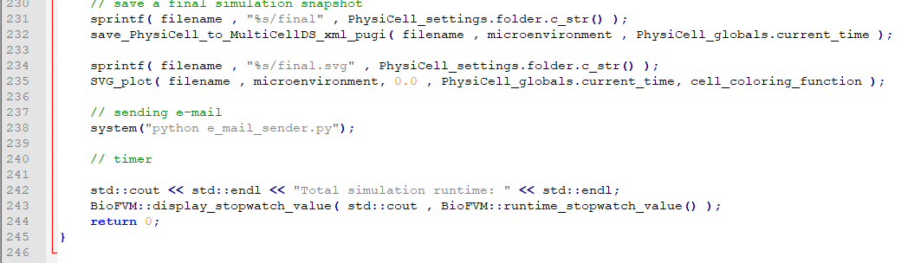

# e_mail_sender
Python script that sends an e-mail.

To use:
1) Place this file to your main PhysiCell directory.
2) Enter your e-mail address in the code (Line #18)
3) Add following line to the end of the main function (after final SVG saving) (Please take following image as an example)
```
    system("python e_mail_sender.py");
```


4) Re-compile your executable.
